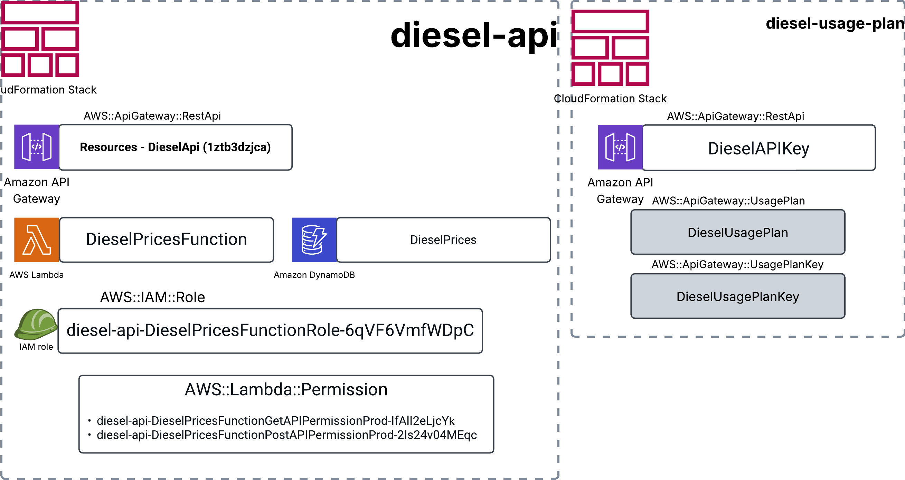

# Diesel Prices API - Serverless Application

This project provides a serverless API for managing diesel fuel prices using AWS SAM (Serverless Application Model), DynamoDB, Lambda, and API Gateway. It includes infrastructure as code, deployment scripts, and data seeding utilities.

## AWS Stack




---

## 🔧 Requirements

- [AWS CLI](https://docs.aws.amazon.com/cli/latest/userguide/install-cliv2.html)
- [AWS SAM CLI](https://docs.aws.amazon.com/serverless-application-model/latest/developerguide/install-sam-cli.html)
- Python 3.11+
- Make

---

## 📂 Project Structure

```
├── Makefile
├── template-base.yml              # SAM template for base stack (Lambda, API, DynamoDB)
├── template-usage-plan.yml        # CloudFormation template for usage plan + API key
├── requirements.txt               # requirements file
├── scripts/
│   ├── get_data.py                # Script to download diesel pricing data
│   ├── clean_data.py              # Script to clean and format the data
│   └── load_data.py               # Script to load data into DynamoDB
└── src/
    └── app.py                     # Lambda function handler
```

---

## 🚀 Deployment

### Deploy Everything (Base Stack + Usage Plan)

```bash
make all
```

---

### Deploy Only the Base Stack

This sets up the Lambda function, API Gateway, and DynamoDB table.

```bash
make deploy-base
```

---

### Deploy Only the Usage Plan Stack

This creates an API Key and Usage Plan to secure the API.

```bash
make deploy-usage
```

---

## 🧨 Teardown

### Delete Both Stacks (Usage Plan First)

```bash
make delete-all
```

### Delete Base Stack Only

```bash
make delete-base
```

### Delete Usage Plan Stack Only

```bash
make delete-usage
```

---

## 📊 Data Management

These scripts help you prepare and load data into the DynamoDB table.
## go to EIA.gov
you need a key to download the data we are using.
 - https://www.eia.gov/opendata/register.php, 

add it to `get_data.py`
```python
...
# get you a akey 
# https://www.eia.gov/opendata/register.php, 
API_KEY = ""
..
```

### Download Raw Data

```bash
make get-data
```

### Clean/Format the Downloaded Data

```bash
make clean-data
```

### Load Data into DynamoDB

```bash
make load-data
```

### Load Sample Data (Alias for `load-data`)

```bash
make load-data-sample
```

---

## 🗝️ After Deployment

Once deployed:
- Use the API endpoint output from `template-base.yml`.
- Use the API key output from `template-usage-plan.yml`.
- Set the key in your API request header:  
  ```http
  x-api-key: YOUR_API_KEY
  ```

---

## ✅ Example Request (Postman or `curl`)

```bash
curl -X GET \
  https://<api-id>.execute-api.<region>.amazonaws.com/Prod/diesel-prices \
  -H "x-api-key: YOUR_API_KEY"
```

---

## 🧹 Cleanup

Don’t forget to run `make delete-all` to avoid incurring AWS charges if you're done testing dummy.

---

## 👨‍💻 Author Notes

This project is designed for quick setup, secure access, and real-world usage of serverless APIs. Contributions and improvements are welcome!
